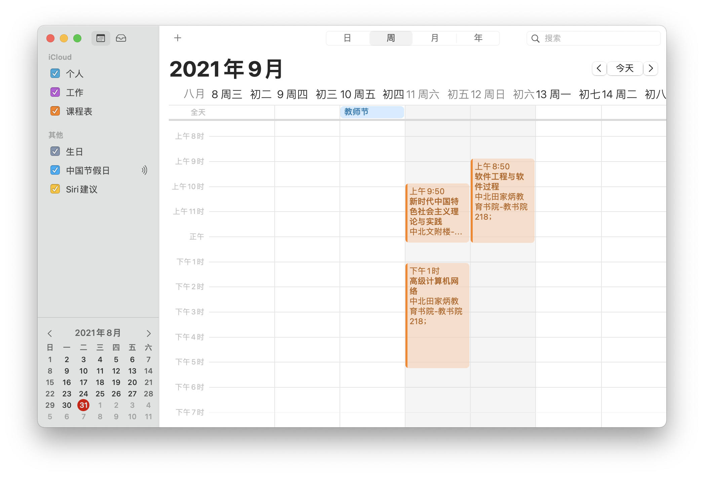

# 华东师范大学课程表生成工具（for Mac）

## 使用方法

将课程表格输入到`resource/class_info.txt`文件下
> 课程信息格式为：  
> {class_name}，{class_info}；  
> 示例如下：
>```text
>新时代中国特色社会主义理论与实践，1-12周，每周星期六，3-5节，地点：中北，中北文附楼，文附楼118；
>```

在main.py文件下指定学期开始日期  
ps:*默认为2021年秋季学期，即2021-9-6*

执行结束后将会`release`目录下生成文件`2021-A-秋.ics`*可自定义*，在mac上双击该文件，选择新建日历，课程表将自动导入至您到日程当中

## 日历订阅
目前最新版本 `v0.21.1` 已发布，可以通过网址 *https://github.com/chonmb/school_timetable/releases/download/v0.21.1/2021-A-autumn.ics* 订阅2021级非全A班课程日历

## 使用效果
导入结果


## 增强功能
|功能描述|计划|备注|
|-------|---|----|
|自动爬取课表数据|未完成||
|自动导入日历|已完成|通过日历订阅可实现同样功能|
|可视化界面|未完成||

## 其他
.ics文件可以在其他Android端，iOS端等进行读取，读取效果也不大相同，大家可以尝试使用

欢迎各位提出issue，这是我开发的动力来源 😊